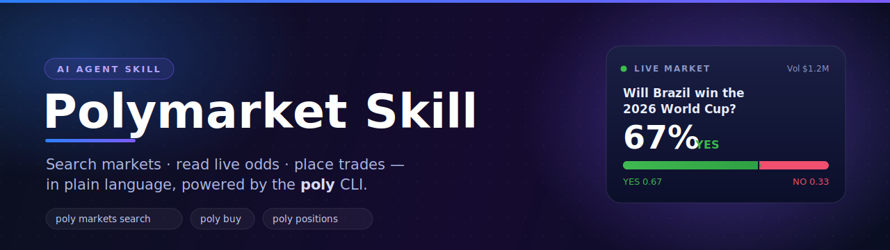

<div align="center">



<br>

[](https://clawhub.ai)
[](https://github.com/NetMindAI-Open/polymarket_cli)
[](https://polymarket.com)
[](SKILL.md)

</div>

---

> **In one line:** drop this folder into your agent and ask *"what are the odds Brazil wins?"* or
> *"buy $5 of YES at 0.42"* — it drives the `poly` CLI for you, with JSON output, dry-run previews, and
> real-money guardrails baked into the instructions.

## ✨ Why you'll like it

- 🔎 **Market discovery** — search markets, live odds, and order books. Public, *no key required*.
- 💰 **Trade** — limit & market orders, batch posting, cancels. Every order can be **previewed first**.
- 📊 **Portfolio at a glance** — positions, USDC balance, portfolio value, order & trade history.
- 🤖 **Agent-native** — structured JSON, clean exit codes, `{"error": …}` on failure. Never blocks on a prompt.
- 🛡️ **Safe by design** — dry-run before live orders, explicit new-wallet activation guidance, loud about real money.
- 🔌 **Portable** — one folder, two homes: **Claude Code** and **OpenClaw / clawhub**.

## 💬 Talk to it

| You say… | It does… |
|---|---|
| *"What are the odds Mexico reaches the Round of 16?"* | `markets search` → `markets get`, reads back the YES price |
| *"How much USDC do I have on Polymarket?"* | `clob balance --asset-type collateral` |
| *"Buy $5 of YES on `<market>` at 0.42."* | dry-run preview → submits with `--yes` |
| *"Show my open positions and portfolio value."* | `data positions` · `data value` |
| *"Cancel all my open orders."* | `clob cancel-all` |
| *"Scan Polymarket for opportunities."* | runs the multi-agent scan → ranked opportunities, auto-fires structural arbs within limits, escalates the rest |

## 📦 What's inside

| File | Purpose |
|---|---|
| 🧠 **[SKILL.md](SKILL.md)** | The skill itself: trigger description, golden rules, command map, trading + wallet workflow, safety. |
| 📖 **[reference/commands.md](reference/commands.md)** | Full `poly` command catalog — flags, JSON shapes, read/write tags. |
| 🍳 **[reference/recipes.md](reference/recipes.md)** | Copy-pasteable workflows: find→price→preview→submit, account checks, new-wallet activation. |

It's **instruction-only** — no code of its own. `poly` is the single source of truth; this skill is the
operating manual that teaches an agent to drive it well.

## ⚡ Quickstart

**1. Install the `poly` CLI** (needs [`uv`](https://docs.astral.sh/uv/)):

```bash
curl -LsSf https://astral.sh/uv/install.sh | sh                          # install uv (macOS / Linux)
uv tool install git+https://github.com/NetMindAI-Open/polymarket_cli.git     # install poly globally
poly --help                                                              # verify
```

> If `poly` isn't found, run `uv tool update-shell` and restart your terminal. Developing the CLI
> itself? Clone it, `uv sync --extra dev`, and run from the checkout with `uv run poly …`.

**2. Configure a signer key** (only for account reads & trading — market search needs none):

```bash
poly setup                     # hidden prompt → ~/.config/polymarket/config.json
# or: poly wallet import 0x<key>
# or: export POLYMARKET_PRIVATE_KEY=0x...
```

**3. Load the Polymarket MCP** (read-only market data — powers search, screening & the scanner):

```bash
claude mcp add --transport http --scope user polymarket \
  https://polymarket.mcp.askcloud.ai/mcp \
  --header "Authorization: Bearer <YOUR_BEARER_TOKEN>"
claude mcp get polymarket      # verify → Status: ✔ Connected
```

> Swap in your own bearer token. The skill reaches the server through `assets/poly-mcp.sh`, which reads
> the URL + token from `~/.claude.json` and never echoes it — more in [reference/mcp.md](reference/mcp.md).

**4. Install the skill:**

```bash
# Claude Code — drop it in so SKILL.md sits at the folder root
cp -R polymarket-skill ~/.claude/skills/polymarket
```

Restart Claude Code; it activates whenever you mention Polymarket, prediction-market odds, or placing a
bet. **OpenClaw / clawhub** — the same folder installs as an OpenClaw skill; users just need `poly` on
their `PATH` via the one-liner above.

> **Developing the skill itself?** Symlink instead of copying, so edits to your working tree are reflected
> in the installed skill with no re-copy:
> ```bash
> ln -s "$(pwd)/polymarket-skill" ~/.claude/skills/polymarket
> ```
> Restart Claude Code after edits to reload (skills load at session start). `rm ~/.claude/skills/polymarket`
> removes only the symlink, never your repo.

## 🆕 New wallet? Activate it first

Importing or creating a key only configures *signing*. A wallet that has **never been used on
Polymarket** can't trade until you activate it **on the website**:

> **polymarket.com** → connect/log in with the wallet → **deposit USDC** → complete the on-screen
> **"Enable Trading" approvals**.

Until then, signing and `--dry-run` work, but live orders fail with `InsufficientAllowanceError`. The
agent will walk you through this — full steps in the
["Activate a brand-new wallet" recipe](reference/recipes.md).

## 🔒 Safety

Trades spend **real USDC on Polygon.** The base `buy`/`sell` flow ships an **autonomous** posture — the
agent may submit live orders with `--yes` without per-order approval — and does **not** enforce spending
limits there (a deliberate, thin-by-design choice; the limits in [SKILL.md](SKILL.md) are guidance). The
**multi-agent scanner is different**: its risk gate enforces hard caps (per-order, per-run, liquidity,
depth) and only auto-executes structural arbs — everything else escalates. Tune those caps in
[reference/config.md](reference/config.md).

✅ Prefer a `--dry-run` preview before any live order &nbsp;·&nbsp; ✅ Tell the agent your per-order /
per-day limits if you want them honored &nbsp;·&nbsp; ✅ A wallet must be funded **and** approved to fill.

<div align="center"><sub>Built on the <a href="https://github.com/NetMindAI-Open/polymarket_cli">poly CLI</a> · type-3 deposit-wallet correct · Decimal-safe pricing</sub></div>
